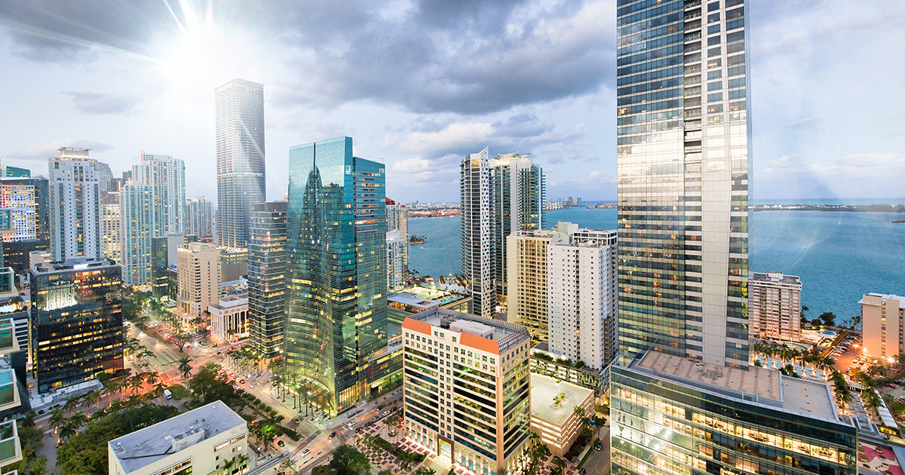

# Assignment 3 – Concurrency
#### Author: Vusal Shirinbayli
This assignment focuses on development of an image processing program in Java. The program processes a given image by dividing it into square boxes of specified size, computing the average color of each box, and then updating the entire box to the average color while gradually showing the changes. The implementation supports both single-threaded and multi-threaded modes.

## Requirements
- Java Development Kit (JDK) 17 or later.

## How to run
1. On Linux/Mac (using run.sh):
- Open a terminal
- Ensure run.sh is executable:
```
chmod +x run.sh
```
- Execute the script with arguments
```
./run.sh <filename.jpg> <square_size> <S|M>
```
2. On Windows (using run.bat):
- Open a Command Prompt or PowerShell window.
- Run the script with arguments:
```
run.bat <filename.jpg> <square_size> <S|M>
```

## Example usage
```
./run.sh ~/dev/3-concurrency-vusalsh/src/sample.jpg 20 S
```
Before:


After:


## Implementation Details
### ImageProcessor
It processes a given **BufferedImage** by dividing it into squares and modifying each square to represent its average color. This class is implemented as a Runnable to make it suitable for multi-threaded execution.
It accepts five parameters:
1. An image to process
2. Square size
3. An ImagePanel to show the changes gradually
4. Y coordinate of the image to start processing
5. Y coordinate of the image to end processing

#### Methods
- **void run()**
    1. Iterates over the specified slice (from yStart to yEnd vertically and the full width horizontally) with steps of square size.
    2. For each square, calculates its average color and fills the section with that color.
    3. Updates the rendering panel and pauses briefly for a visual effect.

- **void paintBox(int xStart, int xEnd, int yStart, int yEnd, int color)**
Colors a specified region of the image with the given color.

- **int getAverageColor(int xStart, int xEnd, int yStart, int yEnd)**
Computes the average color of a given section of the image. The averaging uses the root mean square (RMS) method for each color channel (red, green, blue) in order to produce a more perceptually accurate representation of the average color. (See: [Computer Color is Broken](https://www.youtube.com/watch?v=LKnqECcg6Gw))

- **static BufferedImage resizeImage(BufferedImage image, int width, int height)**
Utility method to resize a given image to the specified dimensions using smooth scaling.

### ImagePanel
The ImagePanel class is a custom **JPanel** implementation designed to display a **BufferedImage**. It handles automatic resizing of the image if its dimensions exceed the screen size.

#### Methods
- **protected void paintComponent(Graphics g)**
Overrides the default paintComponent method to render the image onto the panel. If the image is larger than the screen size, it resizes the image to fit within the screen dimensions.


### Main
1. Validates the input arguments.
2. Reads the input image and displays it in a GUI window.
3. Executes the image processing task either in Single-threaded mode (S) or Multi-threaded mode (M).
4. Saves the processed image to the specified output file (result.jpg).

#### Single-threaded mode
This mode uses the Main thread to execute the run method of **ImageProcessor** object initialized with given image and horizontal coordinates of the start and end of the image.

#### Multi-threaded mode
This mode uses multiple threads to process the image concurrently by dividing it into horizontal sections. The number of threads is determined based on the smaller value between the number of available processors and the number of sections the image can be divided into based on the square size. An **ExecutorService** is used to manage a thread pool for concurrent execution.

##### Workflow
1. The image is divided into horizontal slices, which are assigned to a separate thread.
2. Each thread runs an **ImageProcessor** instance to process its designated slice by calculating and applying the average color for squares within its section.
3. After submitting all tasks, the application waits for the threads to complete their execution.
4. Once all threads finish, the processed image is saved to the file system and the frame is disposed.
